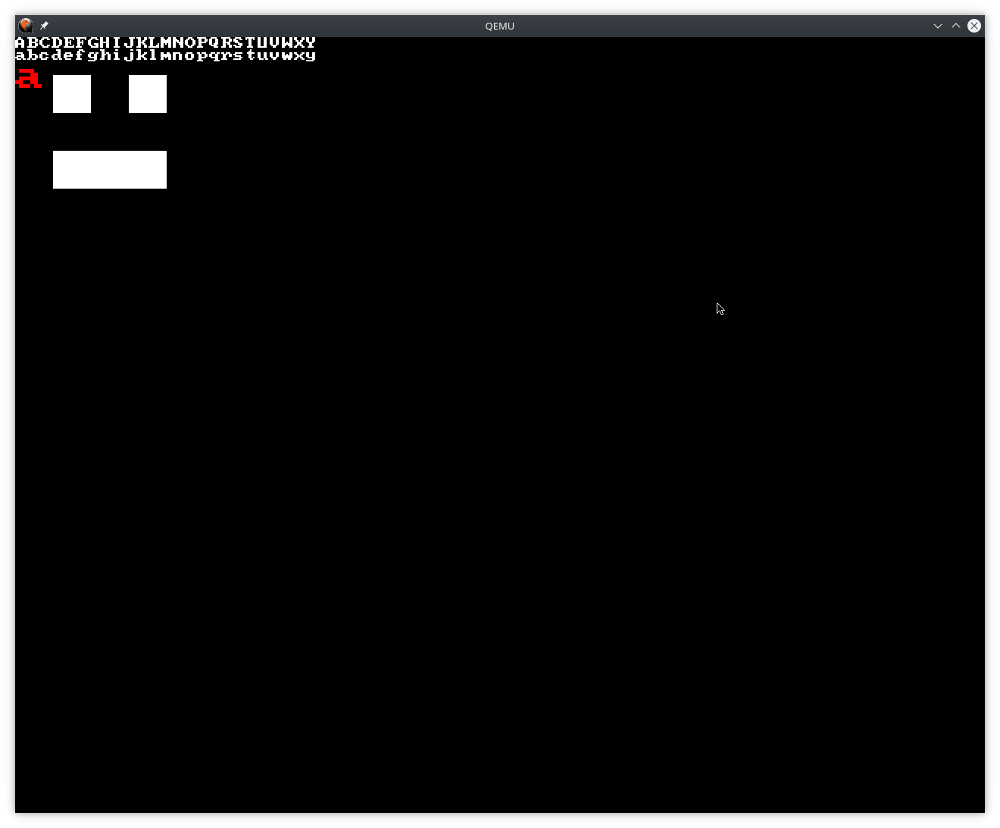

# RedFox32.xyz
### I overhaul a lot of the system often as I learn, this is going to happen soon!
> I've noticed an increase in interest in the project as I have been more active on it again. Please keep in mind I am rarely updating the documentation at the moment as I build up the project base. I will keep it as up to date as possible if the interest is maintained. Please do not try to contribute towards progress, the purpose is for me to learn at my own pace and write everything I can by hand from documentation or by using existing code as a reference. If you would like to provide links to resources or any queries in general then use something from the `Where` section to contact me.

## What is this, where am I?
RedFox32 is a hobby OS project that I am using to learn the ins and outs of the x86 Architecture in addition to helping developers (like you, perhaps) begin their own adventure into the world of bare-metal programming.


## Why?
Why not? Throughout the development of this project I will be producing somewhat detailed documentation providing those who wish to have their own attempt a better head start than what I could source. Sources such as [https://wiki.osdev.org/](https://wiki.osdev.org/)  are great however, I often found that when it came to code samples their was either existing expectations, a lack of explanations, or no code at all, only a rough explanation of what needs to happen.

This project is being built to run on hardware if you so wish it to!

## How?
I spend way too much time doing things like this! The project is made entirely using x86 (intel) Assembly and C. Everything is made from scratch, from the bootloader, to the kernel, to the drivers, I have written it all. 

All development is done on Arch Linux - Kernel: 5.7.12-arch1-1 so if you have problems which I don't, I don't know what you're doing wrong because all you have to do is compile and run, there is a grand total of Zero dependencies!

## Where...
Where? Where!? What do you mean where! Well I'll tell ya! You can view live development of the RedFox32 project over at [https://twitch.tv/RedFox0x20](https://twitch.tv/RedFox0x20)

Get other updates about projects from here:
- [RSS](https://redfox32.xyz/rss.xml)
- [Instagram](https://instagram.com/redfox0x20)
- [WEB](https://redfox32.xyz/)
## Documentation
- Want to get started on your own OS project, here's a guide on what to expect with code samples of my solution to the problem, you can even follow the guide like a tutorial! [RedFox32 OS Development Guide](Documentation/RedFox32DevelopersGuide.pdf)
- Or how about developing an application for the RedFox32 project: [RedFox32 Software Development guide](RedFox32/Documentation/RedFox32SoftwareDevelopmentGuide.pdf)
- Maybe you want to make a driver? [RedFox32 Driver Development Guide](RedFox32/Documentation/RedFox32DriverDevelopmentGuide)

## Requirements
If you want to run this on physical hardware, you're in luck! I have designed for physical hardware so everything will be taken into account! Wow! However, there are some requirements, you will have to boot from a Floppy Drive... Yes, a floppy drive!

Can't meet that requirement? Not to worry just run `make run` and you'll be dropped into a QEMU virtual machine running just fine. How about Virtual Box and other software? Sure why not, give it a go, there will be small things every now and then that I may need to change to properly build for them however they're not the main target.

## Building
We target x86 (32 bit) CPUs as such we need to be able to compile 32bit code! To install the required packages you may need to enable multilib packages for your architecture.
#### Note for Pacman users
You may need to edit `/etc/pacman.conf` by either adding or uncommenting the following:
```
[multilib]
Include = /etc/pacman.d/mirrorlist
```
### Requirements
- qemu-system-i386
- gcc (with 32bit support, may be a seperate package)
- nasm
- dd
- make
That's it, not a lot huh.

Here's a pacman command to install them, sorry debian or other package manager users:
`sudo pacman -Ss gcc gcc-libs lib32-gcc-libs qemu qemu-arch-extra nasm`

### Build from source
Building from source is not reccomended as not every commit will be stable or even run in the first place, I try to avoid pushing broken code onto GitHub however sometimes it is necessary. Apologies in advance. 

Building the project from source yourself couldn't be any easier! Simple run ` make all` and `Build/Floppy.img` will be produced! It's that simple! If you run into errors then I probably pushed some bad code, sorry, it happens sometimes.

### Prebuilt
Prebuilt images will be available once the project is more stable, currently I am working on the Kernel and things are still being drafted, we'll be there soon!
